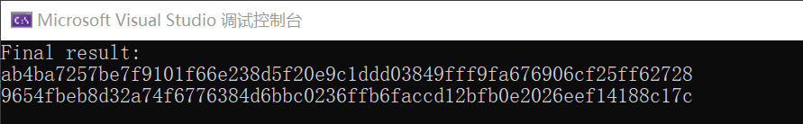

# Project7: Try to Implement this scheme

## 理论介绍：

  	HashWires 是一个基于区块链的去中心化数据存储系统，采用了一种被称为 Hyperefficient Credential-Based Range Proofs（具有超高效证书的区间证明）的证明机制。这种机制通过引入一种称为 HashWire 的新型哈希链结构，使得多个证书可以被压缩成一个证书，并且将证书的大小从 O(n) 压缩到 O(log n)。具体来说，每个证书上都附加了一个哈希值，并与前一个证书串联起来。 HashWire 实质上就是一个哈希链，其中每个哈希值对应一个证书。通过使用 HashWire，Hyperefficient Credential-Based Range Proofs 可以在 O(log n) 的时间内生成，并且证明的大小也只有 O(log n)。
  	
  	相比传统的区间证明机制，它更快速，同时也节省了大量空间，使其在去中心化数据存储系统中更加实用。因此，HashWires 的 Hyperefficient Credential-Based Range Proofs 机制通过引入 HashWire 哈希链结构，可以压缩证书大小并提高证明生成的效率。

## 项目实现：
本项目采用C++语言搭配Openssl来实现hashwires并进行相应的区间证明测试，其中Openssl采用1.1.1l版本，采用的实例化哈希函数为SHA256。

```c++
 std::string _calculate_hash(const std::string& data) const {
        unsigned char hash[SHA256_DIGEST_LENGTH];
        SHA256_CTX sha256;
        SHA256_Init(&sha256);
        SHA256_Update(&sha256, data.c_str(), data.length());
        SHA256_Final(hash, &sha256);

        char buffer[SHA256_DIGEST_LENGTH * 2 + 1];
        for (int i = 0; i < SHA256_DIGEST_LENGTH; ++i) {
            sprintf(&buffer[i * 2], "%02x", hash[i]);
        }

        return std::string(buffer);
    }
```

在代码中定义了两个class:

```c++
class HashWire {
    friend class RangeProof;
public:
    HashWire() {
        head = nullptr;
    }

    void add_certificate(const std::string& certificate) {
        if (head == nullptr) {
            head = new Node{ certificate, "" };
        }
        else {
            Node* new_node = new Node{ certificate, ""};
            new_node->hash = _calculate_hash(new_node->certificate + head->hash);
            head = new_node;
        }
    }

    std::string get_root_hash() const {
        if (head == nullptr) {
            return "";
        }
        return head->hash;
    }

private:
    struct Node {
        std::string certificate;
        std::string hash;
    };

    Node* head;

    std::string _calculate_hash(const std::string& data) const {
        unsigned char hash[SHA256_DIGEST_LENGTH];
        SHA256_CTX sha256;
        SHA256_Init(&sha256);
        SHA256_Update(&sha256, data.c_str(), data.length());
        SHA256_Final(hash, &sha256);

        char buffer[SHA256_DIGEST_LENGTH * 2 + 1];
        for (int i = 0; i < SHA256_DIGEST_LENGTH; ++i) {
            sprintf(&buffer[i * 2], "%02x", hash[i]);
        }

        return std::string(buffer);
    }
};
```

```c++
class RangeProof {
public:
    RangeProof(const std::vector<int>& values) : values(values) {
        for (int value : values) {
            hash_wire.add_certificate(std::to_string(value));
        }
    }

    std::vector<std::string> generate_proof(int start_index, int end_index) {
        std::vector<std::string> proof;

        if (start_index < 0 || end_index >= values.size() || start_index > end_index) {
            return proof;
        }

        HashWire::Node* current_node = hash_wire.head;
        for (size_t i = 0; i < values.size(); ++i) {
            if (i >= static_cast<size_t>(start_index) && i <= static_cast<size_t>(end_index)) {
                proof.push_back(current_node->certificate);
            }
            if (current_node->hash.empty()) {
                break;
            }

            current_node = new HashWire::Node{ current_node->hash, "" };
            current_node->hash = hash_wire._calculate_hash(current_node->certificate + current_node->hash);
        }

        return proof;
    }

private:
    std::vector<int> values;
    HashWire hash_wire;
};
```

其中，add_certificate用于在证明时提供相应的证书内容：

```c++
    void add_certificate(const std::string& certificate) {
        if (head == nullptr) {
            head = new Node{ certificate, "" };
        }
        else {
            Node* new_node = new Node{ certificate, ""};
            new_node->hash = _calculate_hash(new_node->certificate + head->hash);
            head = new_node;
        }
    }
```

在主函数中返回索引1至索引2的区间证明(闭区间)：

```c++
int main() {
    std::vector<int> values = { 1, 2, 3, 4 };
    RangeProof range_proof(values);
    std::vector<std::string> proof = range_proof.generate_proof(1, 2);
    std::cout << "Final result:" << std::endl;
    for (const auto& certificate : proof) {
        std::cout << certificate << std::endl;
    }

    return 0;
}
```

运行结果如下图所示：



